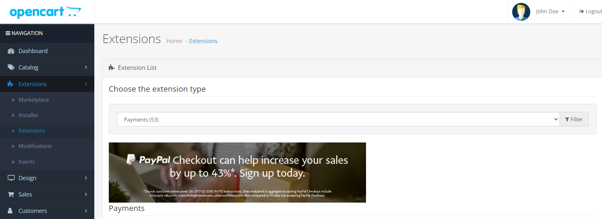

# HitPay 

## Installing

== Method 1: ==
1. Download the latest released packaged from (https://github.com/hit-pay/opencart-extension/releases) with extension as .ocmod.zip
2. Log in to admin
3. Navigate to Extensions => Installer
4. Browser your package and click upload button.

== Method 2: ==

1. Download the latest released packaged from (https://github.com/hit-pay/opencart-extension/releases)
2. Unzip the package.
3. And upload the files of 'upload' folder to under path/to/project/ folder via FTP.
4. This package not overwriting any core files.

== Install ==

1. If you followed either Method 1 or Method 2, you need to navigate Extensions => Extensions
2. Choose the Extension type as 'Payments'

3. Scroll down to locate the HitPay Payment Gateway

4. Click green colored + icon to install the extension.

## Upgradation

== Method 1: ==
1. Download the latest released packaged from (https://github.com/hit-pay/opencart-extension/releases) with extension as .ocmod.zip
2. Log in to admin
3. Navigate to Extensions => Installer
4. Browser your package and click upload button. This would overwrite/replace the old extension files.

== Method 2: ==

1. Download the latest released packaged from (https://github.com/hit-pay/opencart-extension/releases)
2. Unzip the package.
3. And upload the files of 'upload' folder to under path/to/project/ folder via FTP.
4. This would overwrite/replace the old extension files.

## Configuration

1. Navigate Extensions => Extensions
2. Choose the Extension type as 'Payments'

3. Scroll down to locate the HitPay Payment Gateway

4. Click red colored - icon to edit the extension.

5. Go to dashboard of hitpay:

6. Copy api key and salt from hitpay dashboard to opencart extension in the same named fields

## Using

1. Payment

2. Checking orders

## Refunds

1. Log in to Admin
2. Navigate to Sales ⇒ Orders
3. Click view icon link to navigate to Admin Order Details page.
4. If order is paid via 'HitPay Payment Gateway' and payment is successful and transaction id saved on the Database, then following screen will be displayed in the Admin Order view: (Scroll down to locate the HitPay Refund tab in the Order History section)

5. Click blue colored 'Refund' Button, this will show the below screen:

6. You can enter Full amount or Partial amount, but 0 or greater than total paid will not be allowed.
7. Click blue colored 'REFUND PAYMENT' button to initiate the Refund. If gateway accepted the refund request and the Refund details will be displayed like the below screen:
8. If full amount is refunded, then order status will be changed to 'Refunded' automatically.
9. Only one refund is allowed per transaction.
10. Refund is only applicable if the initial charge was made with PayNow or Card.

## Changelog

= 1.0.0 =
* Initial release.

== Upgrade Notice ==

= 1.1.4 =
- Refund feature added.

= 1.1.5 =
- HitPay payment details displayed under admin order total section
- Merchants can enter their own payment title which will display during the checkout.
- Merchants can choose their own order status which would be set upon successful payment.

= 1.1.6 =
- Added api channel field to the gateway

= 1.2.0 =
- Added FPX and Zip Payment logos selection